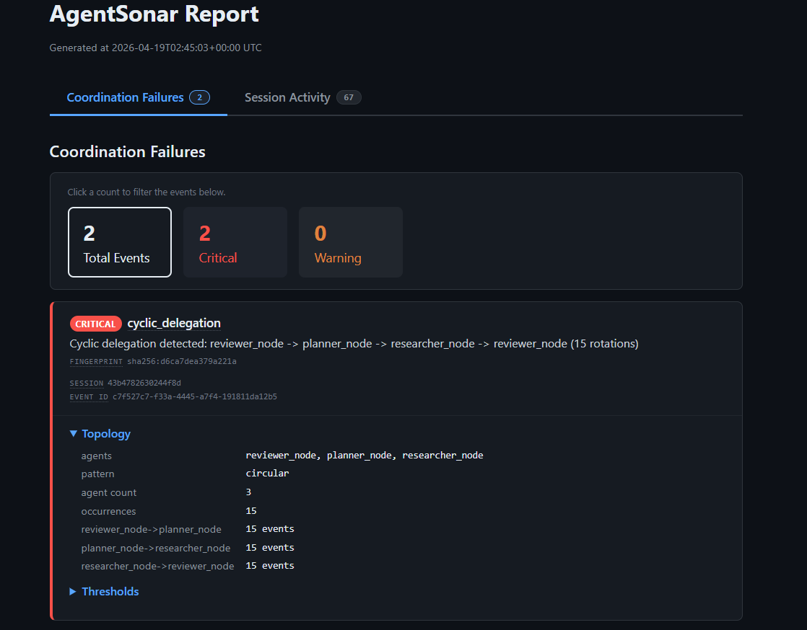

# AgentSonar

**Detect coordination failures in multi-agent AI systems — in real time.**

When agents get stuck in infinite loops, spam each other with
redundant delegations, or blow through a rate limit, standard
tracing tools show you a timeline AFTER the fact. AgentSonar
watches the conversation BETWEEN agents and surfaces the failure
as it's happening — in milliseconds, while your crew or graph is
still running.

Think **Sentry, but for multi-agent AI systems**.

---

## Install

```bash
pip install agentsonar               # custom orchestrators — no extras needed
pip install agentsonar[crewai]       # for CrewAI
pip install agentsonar[langgraph]    # for LangGraph / LangChain
pip install agentsonar[all]          # crewai + langgraph
```

Available on PyPI: **[pypi.org/project/agentsonar](https://pypi.org/project/agentsonar/)**

## Two-line integration

**CrewAI:**

```python
from agentsonar import AgentSonarListener
sonar = AgentSonarListener()
# ...run your crew normally. Detection happens automatically.
```

**LangGraph / LangChain:**

```python
from agentsonar import monitor
graph = monitor(graph)
result = graph.invoke(input)
```

**Custom orchestrator** (hand-rolled Python, subprocess pipelines, Celery DAGs):

```python
from agentsonar import monitor_orchestrator
sonar = monitor_orchestrator()
sonar.delegation(source="planner", target="researcher")
# ...run your agents normally...
sonar.shutdown()
```

That's the whole API. No accounts, no API keys, zero config required.

## What gets detected

Three coordination failure classes currently supported:

- **Cyclic delegation** — agents stuck in a loop (reviewer never
  approves, planner always says "revise", etc.)
- **Repetitive delegation** — one agent hammering another without
  making progress
- **Resource exhaustion** — runaway event throughput that would
  burn through your token budget if left unchecked

All three fire as structured alerts in real-time via stderr, a
JSONL timeline, a human-readable alerts log, and a standalone HTML
report you can email or attach to a bug ticket.

## Validated against frontier models

Skeptical that top-tier models like Claude Opus 4.6 or Gemini
actually get stuck in loops? They do — and smarter models make it
*worse*, not better, because a more capable reviewer finds more
subtle issues to flag on every pass. We reproduced three
coordination-failure scenarios (cyclic delegation, repetitive
delegation, spawn explosion) on real LangGraph workloads running
Sonnet 4 and Opus 4.6 with natural non-rigged prompts. AgentSonar
flagged each one in real time.

→ Full scenarios and alert output:
**[`docs/VALIDATION.md`](docs/VALIDATION.md)**

## What the output looks like

Every run produces a self-contained HTML report — no external CSS
or JavaScript, no network requests, dark mode that respects your
system preference. Two top-level tabs organize the view:

**1. Coordination Failures** — the primary signal. One card per
detected failure with severity badge, failure class (hover for a
definition), fingerprint, and expandable topology / thresholds /
provider-error / downstream-impact blocks. Filter chips at the top
let you narrow to Critical or Warning with one click.



**2. Session Activity** — INFO-level context, always one click away.
Two sub-tabs switch between lenses on the same run:

- **Edge Activity** — every delegation edge the graph saw, with fire
  count and severity attribution. Red border = edge involved in a
  critical alert, no border = clean. Scans in seconds, even on
  hundred-event sessions.
- **Chronological Log** — raw event stream with timestamps. Rows
  color-coded where an alert fired: light red for critical, light
  orange for warning. Lets you see *when* coordination broke relative
  to surrounding traffic.


The "Coordination Failures — Raw JSON" drop-down at the bottom of
every report carries the same payload as `report.json` — copy it
straight into a dashboard or CI gate without opening a second file.

All four output files land in a per-run session directory under
`agentsonar_logs/`:

| File | Written | Purpose |
|---|---|---|
| `timeline.jsonl` | **Live — flushed on every event** | Every event, one JSON object per line. Tail with `tail -f` to watch what's happening as your crew runs. |
| `alerts.log` | **Live — flushed on every alert** | Signal-only, human-readable. The "just show me the problems" view. |
| `report.json` | On `shutdown()` | Structured summary report, deduped + inhibited. Pipe into your dashboard. |
| `report.html` | On `shutdown()` | The standalone two-tab HTML report shown above. |

The two `.jsonl` / `.log` files mean you don't have to wait for
your crew to finish to see what went wrong. Open a second terminal
and `tail -f agentsonar_logs/<latest>/timeline.jsonl` — coordination
failures surface the moment they happen.

## Current status

**Closed beta.** Actively deployed in the environments of six design
partners. Python SDK only, Apache-2.0 licensed, published to PyPI.

Source repository is currently private during the beta. This public
repo exists for:

- **Issues tab** — file bug reports, feature requests, and
  questions. Maintainers respond here.
- **Discussions** — general feedback, integration questions,
  show-and-tell.
- **Release notes** — see [`CHANGELOG.md`](CHANGELOG.md).

If you'd like to be considered as a design partner, open an issue
describing your multi-agent workload and we'll follow up.

## Contact / feedback

We read everything. Reach out whichever way fits your question:

- **Open an issue** — fastest, public, searchable by other users who
  may hit the same thing. Structured templates for
  [bug reports](https://github.com/agentsonar/agentsonar/issues/new?template=bug_report.yml),
  [feature requests](https://github.com/agentsonar/agentsonar/issues/new?template=feature_request.yml),
  and [general feedback or questions](https://github.com/agentsonar/agentsonar/issues/new?template=feedback.yml).
  Maintainers respond here.
- **Email** — <agentsonarai@gmail.com> for private feedback, design
  partner inquiries, security reports, or anything that doesn't fit
  a public issue.

## Links

- **PyPI:** <https://pypi.org/project/agentsonar/>
- **Validation on frontier models:** [`docs/VALIDATION.md`](docs/VALIDATION.md)
- **Changelog:** [`CHANGELOG.md`](CHANGELOG.md)

## License

Apache-2.0
