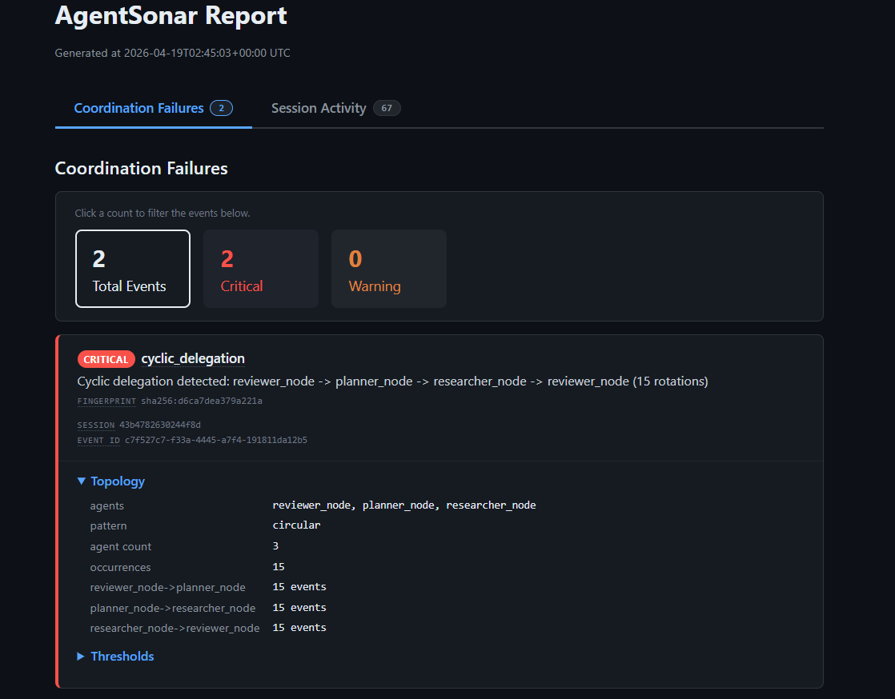
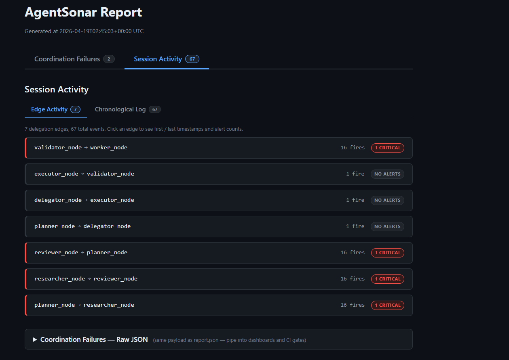

# AgentSonar

**Your AI agents are burning money right now.**
*Detect agent loops and runaway token spend in real time. Stop them before the bill arrives.*

When AI agents talk to each other, they fail quietly. They get stuck
repeating themselves, ping-pong the same handoff, or hammer the LLM
until your credit card melts. AgentSonar watches the traffic between
your agents in real time and can stop the loop before the next API call.

Works with **CrewAI**, **LangGraph**, **OMA (TypeScript)**, or any other
framework via our universal Python adapter. Don't see your framework?
[Request it](https://github.com/agentsonar/agentsonar/issues/new?template=feature_request.yml)
and we'll plug it in for you.

[Website](https://www.agent-sonar.com) · [Discord](https://discord.gg/cPPD4xHe) · [PyPI](https://pypi.org/project/agentsonar/) · [npm (`@agentsonar/oma`)](https://www.npmjs.com/package/@agentsonar/oma) · [Issues](https://github.com/agentsonar/agentsonar/issues)

---

## What you get

**Real-time detection**: three coordination failure classes, all live today:

- **Cyclic delegation**: agents stuck in a loop (reviewer never approves, planner always says "revise")
- **Repetitive delegation**: one agent hammering another without making progress
- **Resource exhaustion**: runaway throughput that would burn your token budget

Each fires structured alerts to stderr, a JSONL timeline, a human-readable
alerts log, and a self-contained HTML report.

**🛑 Prevent Mode (opt-in)**: auto-raise on detected loops, before more LLM calls happen.


→ Full Prevent Mode walkthrough: [`docs/prevent-mode.md`](docs/prevent-mode.md)

---

## Install

```bash
pip install agentsonar               # any framework, including your own Python code
pip install agentsonar[crewai]       # for CrewAI
pip install agentsonar[langgraph]    # for LangGraph / LangChain
pip install agentsonar[all]          # crewai + langgraph
```

PyPI: [pypi.org/project/agentsonar](https://pypi.org/project/agentsonar/) · npm: [@agentsonar/oma](https://www.npmjs.com/package/@agentsonar/oma) (TypeScript / OMA)

No accounts. No API keys. Zero config required.

---

## Quick start by stack

Pick the adapter that matches yours. Each is two lines.

### CrewAI

```python
from agentsonar import AgentSonarListener
sonar = AgentSonarListener()
# ...run your crew normally. Detection happens automatically.
```

→ [`docs/adapters/crewai.md`](docs/adapters/crewai.md)

### LangGraph / LangChain

```python
from agentsonar import monitor
graph = monitor(graph)
result = graph.invoke(input)
```

→ [`docs/adapters/langgraph.md`](docs/adapters/langgraph.md)

### Any other framework: plug in directly with Python

For your own Python code, whether that's a simple `while` loop calling
the OpenAI SDK, a script you wrote with Cursor, the OpenAI Agents SDK,
or anything else not in the list above:

```python
from agentsonar import monitor_orchestrator

sonar = monitor_orchestrator()

# Tell AgentSonar each time one agent hands work to another:
sonar.delegation(source="planner", target="researcher")
# ...run your agents normally...
sonar.delegation(source="researcher", target="writer")
# ...

sonar.shutdown()
```

This is the universal adapter. One explicit call per agent-to-agent
handoff and you get the full detection + Prevent Mode surface, identical
to the framework adapters.

**Want native support for your framework instead?** Just ask,
[open a feature request](https://github.com/agentsonar/agentsonar/issues/new?template=feature_request.yml)
and we'll add it. We've shipped past adapters in days, not weeks.

→ [`docs/adapters/custom-python.md`](docs/adapters/custom-python.md): full API reference, examples for OpenAI Agents SDK / Celery / subprocesses, configuration

### Open Multi-Agent (OMA, TypeScript)

```typescript
import { emitDelegations, createTraceHandler, shutdown } from '@agentsonar/oma'
// + run a small Python sidecar that bridges to the engine
```

→ [`docs/adapters/oma.md`](docs/adapters/oma.md)

---

## Prevent Mode: stop the loop before the bill arrives

Detection alone tells you what happened. **Prevent Mode** raises an
exception the moment a tracked failure crosses the trip threshold,
letting your code stop a runaway loop before the next LLM call.

```python
from agentsonar import monitor_orchestrator, PreventError

sonar = monitor_orchestrator(config={
    "prevent": {"cyclic_delegation": True}
})

try:
    while True:
        sonar.delegation("reviewer", "generator")
        # ...your agents run...
        sonar.delegation("generator", "reviewer")
        # ...
except PreventError as e:
    print(f"Stopped: {e.reason}")
    print(f"Cycle:   {' -> '.join(e.cycle_path)}")

sonar.shutdown()
```

Available in the **Custom Python**, **LangGraph**, and **OMA (TypeScript)**
adapters today. Off by default. Opt in with one config key.

→ [`docs/prevent-mode.md`](docs/prevent-mode.md): full guide: trip thresholds, escape hatch, how to use with any adapter

---

## Configuration

The two-line install uses sensible defaults. To tune:

```python
sonar = monitor_orchestrator(config={
    "warning_threshold":  5,    # alert at this rotation count
    "critical_threshold": 15,   # escalate at this count
    "prevent": {"cyclic_delegation": True},  # opt-in Prevent Mode
})
```

Twenty-plus more knobs (rate-limit windows, decay half-life, log dir,
report titles, …), all documented at:

→ [`docs/configuration.md`](docs/configuration.md)

---

## What it produces

Every run writes four output files to `agentsonar_logs/run-<slug>/`:

| File | When | Purpose |
|---|---|---|
| `timeline.jsonl` | live | Every event, one JSON object per line. `tail -f` it during a run. |
| `alerts.log` | live | Signal-only, human-readable. The "just show me the problems" view. |
| `report.json` | shutdown | Structured summary, deduped + inhibited. Pipe into your dashboard. |
| `report.html` | shutdown | Standalone report, no external CSS / JS / network. Email it. |

The HTML report has two top-level tabs:

**1. Coordination Failures**: primary signal. One card per detected failure with severity badge, fingerprint, and expandable topology / threshold / impact blocks.



**2. Session Activity**: INFO-level context. Edge Activity (per-edge fire counts) + Chronological Log (every event with row-coloring on alerts).



---

## Validated against frontier models

Skeptical that top-tier models like Claude Sonnet 4.5 or Gemini actually
get stuck in loops? They do, and smarter models make it *worse*, not
better, because a more capable reviewer finds more subtle issues to flag
on every pass. We reproduced three coordination-failure scenarios on real
LangGraph workloads running Sonnet 4 and Opus 4.6 with natural,
non-rigged prompts. AgentSonar flagged each one in real time.

---

<a id="whats-next"></a>
## What's next

AgentSonar today ships **Detection** + **Prevent Mode**. Same graph,
different products on the same substrate:

| Next | Rough timing | What it unlocks |
|---|---|---|
| **OpenAI Agents SDK + Claude Agent SDK** native adapters | ~2–3 weeks | Same one-import integration as CrewAI / LangGraph for the two SDKs most teams build agents on right now. (For now, the [Python adapter](docs/adapters/custom-python.md) works as a bridge.) |
| **Cost attribution** (FinOps) | ~6 weeks | Token cost per agent AND per delegation edge. Answers *"which coordination pattern burned the most this week?"* without leaving the tool. |
| **Dynamic-delegation tracking** | ~8 weeks | Instrument runtime handoff patterns (e.g. `delegate_to_agent` tools, OpenAI handoffs) that static adapters under-capture today. |
| **Governance / audit trails** | longer | EU AI Act Article 12 logs, SOC 2 decision lineage, the compliance tier enterprises will need before the August 2026 EU enforcement date hits. |

If there's a specific detector or expansion area you'd want moved up,
[open an issue](https://github.com/agentsonar/agentsonar/issues/new?template=feature_request.yml), feature priority is driven by real user requests.

---

## Documentation

For the full guide, start at [`docs/README.md`](docs/README.md). Quick jumps:

| Topic | Where |
|---|---|
| **Start here**: full docs index with reading order | [`docs/README.md`](docs/README.md) |
| **Adapters**: per-framework integration guides | [`docs/adapters/`](docs/adapters/) |
| **Prevent Mode**: opt-in auto-stop on detected failures | [`docs/prevent-mode.md`](docs/prevent-mode.md) |
| **Configuration**: the full 20+ config knobs | [`docs/configuration.md`](docs/configuration.md) |
| **Concepts**: what's a cycle, what's coordination failure (plain English) | [`docs/concepts.md`](docs/concepts.md) |
| **Examples**: real scenarios with concrete dollar pain | [`docs/examples/`](docs/examples/) |
| **Validation**: alert output on real frontier-model workloads | [`docs/VALIDATION.md`](docs/VALIDATION.md) |
| **FAQ**: common questions, answered | [`docs/faq.md`](docs/faq.md) |

---

## Current status

**Closed beta, expanding.** Apache-2.0 licensed.

This public repo exists for:

- **Issues tab**: bug reports, feature requests, questions ([templates](https://github.com/agentsonar/agentsonar/issues/new/choose))
- **Discussions**: feedback, integration questions, show-and-tell
- **Release notes**: [`CHANGELOG.md`](CHANGELOG.md)

If you'd like to be considered as a design partner, open an issue
describing your multi-agent workload and we'll follow up.

---

## Contact

- **Open an issue**: fastest, public, searchable: [bug](https://github.com/agentsonar/agentsonar/issues/new?template=bug_report.yml) · [feature request](https://github.com/agentsonar/agentsonar/issues/new?template=feature_request.yml) · [feedback](https://github.com/agentsonar/agentsonar/issues/new?template=feedback.yml)
- **Email**: [agentsonarai@gmail.com](mailto:agentsonarai@gmail.com) for private feedback, design partner inquiries, security reports

## Links

- Website: [agent-sonar.com](https://www.agent-sonar.com)
- Discord: [discord.gg/cPPD4xHe](https://discord.gg/cPPD4xHe)
- PyPI: [`agentsonar`](https://pypi.org/project/agentsonar/)
- npm (TypeScript / OMA): [`@agentsonar/oma`](https://www.npmjs.com/package/@agentsonar/oma)
- Validation: [`docs/VALIDATION.md`](docs/VALIDATION.md)
- Changelog: [`CHANGELOG.md`](CHANGELOG.md)

## License

Apache-2.0
