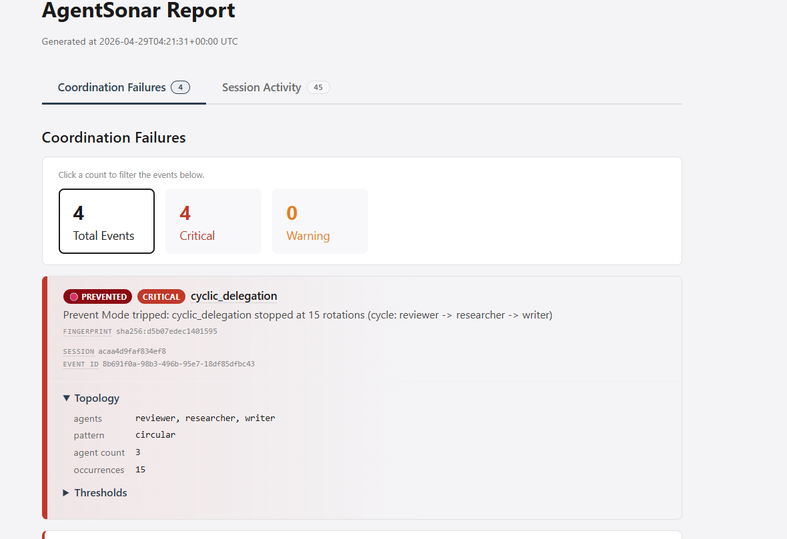

# AgentSonar

**Coordination intelligence for AI.**

Catch the coordination failures that tracing tools miss — silent loops, the same work repeated over and over, runaway subagent fan-out, hung tool calls, failing-tool retry storms, and sessions sliding off the context-window cliff. Each call looks fine on its own; the failure is in the *shape* of the traffic.

**Today, AgentSonar works with single agents calling tools and multi-agent systems** — from a single Claude Code session (every tool call and subagent it makes) to orchestrators where agents hand work to each other. Use it with **Claude Code, CrewAI, LangGraph, custom Python orchestrators, or Node / Electron orchestrators**. If your framework isn't directly supported yet, the custom path works with anything you've wired together yourself.

**Coming soon (other AI system shapes):**

- 🛣 RAG pipelines (retriever → re-ranker → generator)
- 🛣 Custom buses between agents

One install. No accounts. No remote dashboard.

[Website](https://www.agent-sonar.com) · [Discord](https://discord.gg/cPPD4xHe) · [PyPI](https://pypi.org/project/agentsonar/) · [npm](https://www.npmjs.com/package/agentsonar) · [Issues](https://github.com/agentsonar/agentsonar/issues)

---

## A scenario you've probably hit

You wire up three agents:

- A **Researcher** gathers source material.
- A **Writer** turns the research into a draft.
- A **Reviewer** checks the draft. If the Reviewer isn't happy, the draft goes back to the Researcher for another pass.

It's a classic multi-agent setup. But there's a hidden failure mode: **what if the Reviewer is never satisfied?**

The three agents keep handing work to each other. Forever. Your trace viewer shows hundreds of clean LLM calls — each one looks fine on its own. Tokens burn. The bill climbs. No one in the chain is checking whether the loop is actually making progress.

AgentSonar watches the *shape* of the traffic between your agents. The moment the Researcher → Writer → Reviewer → Researcher loop crosses the threshold you set, AgentSonar fires an alert. Open the HTML report and you see the loop drawn as a graph, the rotation count, and the exact moment it tripped. Turn on **Prevent Mode** and the run halts automatically before the next LLM call.



---

## What it catches

### Detect (shipped)

- ✅ **Silent loops** — your Researcher gathers material and sends it to the Writer, the Writer drafts something and sends it to the Reviewer, the Reviewer flags an issue and sends it back to the Researcher. Round and round, forever. The Reviewer never approves. Tokens burn, no output ever ships.
- ✅ **Repeated agent calls** — your Writer asks the Researcher for the same thing 47 times in a row ("find competitor pricing", "find competitor pricing", "find competitor pricing"…). The Researcher returns the same answer each time. The Writer never moves on.
- ✅ **Traffic spikes between agents** — a sudden burst of agent-to-agent calls (the Writer fires off work to the Researcher 200 times in 30 seconds) that's wildly out of pattern with normal traffic, even if no single pair is repeating.
- ✅ **Redundant work** — an agent calls the same tool with the same arguments again and again, getting nothing new back each time.
- ✅ **Stuck / hung tool calls** — a tool (including a hung MCP server) that starts and never returns, so the agent waits on something that will never come.
- ✅ **Subagent explosion** — a runaway fan-out of subagents spawned at once, quietly multiplying the token bill.
- ✅ **Failed-tool retry storms** — an agent hammering the same failing tool or endpoint over and over instead of stopping or routing around it.
- ✅ **Context-window cliff** — the session filling the model's context window toward the point where quality degrades and the next autocompact kicks in, read from the real token counts.

### Prevent (shipped, opt-in)

- ✅ **Auto-stop** — when a coordination failure crosses the limit you set, AgentSonar stops the run before the next call. It raises a typed `PreventError` your code catches; on **Claude Code** it can instead prompt you to approve (ask) or hard-block the tool call (deny). Prevent Mode now spans every shipped failure class.

→ Full walkthrough: [`docs/prevent-mode.md`](docs/prevent-mode.md)

### Coming soon

- 🛣 **Deadlocks** — two agents wait on each other and neither can move. The Researcher is waiting for the Writer's brief; the Writer is waiting for the Researcher to confirm scope. Both sit there forever.
- 🛣 **Groundless response** — agent answers customer questions without consulting any tool.
- 🛣 **Retrieval thrash** — agentic RAG re-fetching the same content 20+ times.
- 🛣 **Cost runaway** — real-time projection: *"this cycle will cost $X if not stopped."*

…and many more coordination and silent failures we're tracking. If you want a specific failure mode added, [request a feature](https://github.com/agentsonar/agentsonar/issues/new?template=feature_request.yml) or [open an issue](https://github.com/agentsonar/agentsonar/issues/new/choose).

---

## What it saves you

A stuck coordination failure doesn't just look bad in a trace — it bills you for every wasted call. This is documented, not hypothetical:

- A four-agent pipeline expected to cost ~$0.80/run **burned $47** on one stuck researcher loop ([LeanOps, 2026](https://leanopstech.com/blog/agentic-ai-cost-runaway-token-budget-2026/)).
- An agent left running overnight came back to a **$437** bill ([Dev Journal, 2026](https://earezki.com/ai-news/2026-04-29-i-let-my-ai-agent-run-overnight-it-cost-437/)).
- A tool-call loop fired **14,000 identical `list_files` calls** before anyone noticed ([LeanOps, 2026](https://leanopstech.com/blog/agentic-ai-cost-runaway-token-budget-2026/)). Others on record: $800, $2,000, $4,200.

AgentSonar catches these early, and with Prevent Mode it stops them before the next call. Two worked examples at [Claude Sonnet pricing](https://platform.claude.com/docs/en/about-claude/pricing) ($3 / $15 per million input / output tokens). The dollar figures are illustrative — your tokens-per-call will vary — but the *shape* of the saving doesn't.

**Example 1 — a silent loop, auto-stopped.** A reviewer ↔ generator loop, ~2 model calls per rotation, ~6K input + 1.5K output each (≈ $0.08/rotation).

| | Rotations | Cost |
|---|---|---|
| Unattended (noticed next morning, ~1 rotation / 30s) | ~960 | **~$77** |
| With Prevent Mode (stops at rotation 15) | 15 | **~$1.20** |
| **Saved** | | **~$76** |

**Example 2 — redundant tool calls, caught at call #3.** The 14,000-call incident above, at ~2K input + 0.5K output per repeated call.

| | Identical calls | Cost |
|---|---|---|
| Unchecked | 14,000 | **~$190** |
| `redundant_work` + Prevent (blocks the 4th) | 3 | **~$0.04** |
| **Saved** | | **~$190** |

The point isn't the exact dollar figure — it's that a failure that would otherwise run unattended for hours (or thousands of calls) is caught in seconds, at single-digit-call cost. Even at a tenth of these token estimates, Example 2 still saves ~$19.

---

## Framework support

| Framework | Status |
|---|---|
| **Custom Python** (any framework, no orchestrator) | ✅ Shipped |
| **Custom Node / TypeScript** (any framework, no orchestrator) | ✅ Shipped |
| **LangGraph** | ✅ Shipped |
| **Claude Code** (terminal CLI + desktop app) | ✅ Shipped |
| **CrewAI** | ✅ Shipped (detect-only; auto-stop on the way) |
| **Electron / Node bus** (OMA sidecar) | ✅ Shipped |
| **OpenAI Agents SDK** | 🛣 Coming soon |
| **Anthropic Claude Agent SDK** | 🛣 Coming soon |
| **AutoGen** | 🛣 Coming soon |

If your framework isn't listed here, use the **Custom Python** or **Custom Node / TypeScript** path in the Quick Start below — both work with anything you've wired together yourself.

---

## Quick start

### Try it in 5 seconds (no framework)

After installing AgentSonar (either language), run the bundled demo to see it work end-to-end:

```bash
# Python
pip install agentsonar
agentsonar demo
# (or: `python -m agentsonar demo` — works without `agentsonar` on PATH,
#  helpful on Windows or inside an unactivated virtual environment)

# Node
npm install agentsonar
npx agentsonar demo
```

Three agents (Researcher → Writer → Reviewer) get stuck in a silent loop. The Reviewer never approves, so the work bounces forever. AgentSonar catches the loop at the 5th rotation, stops the run, and writes a self-contained HTML report you can open in your browser. No config, no API keys, no external dependencies — useful both as a smoke test (confirms the install worked) and as a 30-second walkthrough of the product.

The same scenario, the same output, runs identically on both SDKs.

### Pick your framework

Now wire AgentSonar into your real code. Each card has the install command, the minimal wire-in, and a link to the full guide.

### LangGraph

```bash
pip install agentsonar[langgraph]
```

```python
from agentsonar import monitor

graph = monitor(your_graph.compile())   # one line — that's the whole change
graph.invoke({"input": "..."})
```

→ Full guide: [`docs/adapters/langgraph.md`](docs/adapters/langgraph.md)

### Claude Code (terminal CLI + desktop app)

```bash
pip install agentsonar
agentsonar install-claude-hooks   # wires .claude/settings.json, merge-safe
# (or: python -m agentsonar install-claude-hooks)
```

Start a fresh Claude Code session — every tool call and subagent is now watched,
content-blind. Turn on Prevent Mode and AgentSonar will prompt you (or hard-block)
before a runaway tool call.

→ Full guide: [`docs/adapters/claude-code.md`](docs/adapters/claude-code.md)

### CrewAI

```bash
pip install agentsonar[crewai]
```

```python
from agentsonar import AgentSonarListener

listener = AgentSonarListener()       # auto-attaches to CrewAI's event bus
crew.kickoff()
listener.shutdown()
```

→ Full guide: [`docs/adapters/crewai.md`](docs/adapters/crewai.md)

### Custom Python (no framework, or any framework not listed)

```bash
pip install agentsonar
```

```python
from agentsonar import monitor_orchestrator

sonar = monitor_orchestrator()
# ...your code... whenever one agent hands off to another:
sonar.delegation(source="researcher", target="writer")
sonar.shutdown()
```

→ Full guide: [`docs/adapters/custom-python.md`](docs/adapters/custom-python.md)

### Node / Electron

```bash
npm install agentsonar
```

```javascript
import { AgentSonar } from 'agentsonar'

const sonar = new AgentSonar({})
sonar.delegation('researcher', 'writer')
await sonar.shutdown()
```

→ Full guide: [`docs/adapters/`](docs/adapters/) (Node-side adapter docs)

### After your run

```bash
open agentsonar_logs/run-<latest>/report.html
```

That's it. No API keys. No setup beyond the install.

---

## How AgentSonar is different from tracing

AgentSonar is a *failure detector*, not a *trace viewer*. Tracing tools show you what happened. AgentSonar tells you when something is going wrong, while it's still going wrong — and optionally stops it.

---

## Install

### Python

```bash
pip install agentsonar               # works with any Python framework
pip install agentsonar[crewai]       # CrewAI
pip install agentsonar[langgraph]    # LangGraph / LangChain
pip install agentsonar[all]          # all of the above
```

### Node / Electron

```bash
npm install agentsonar
```

> **Heads up:** AgentSonar sends one anonymous session-start event per run (install ID, version, OS, adapter, no agent content). On by default, opt-out with `AGENTSONAR_TELEMETRY=off` or `DO_NOT_TRACK=1`. [What's collected and why](https://www.agent-sonar.com/telemetry).

---

## Examples (5 minutes, no API key)

Three runnable before/after examples in this repo. Each one is a complete folder with its own `README.md` that walks you through the run step by step. **Open the folder's README first — it has the exact commands.**

### How to get them

**Option 1 — clone the whole repo (recommended):**

```bash
git clone https://github.com/agentsonar/agentsonar-public.git
cd agentsonar-public/examples/custom-python   # or langgraph / node
# then follow that folder's README.md
```

**Option 2 — copy individual files from GitHub:** open the folder link below, click any file, hit the "Raw" button, and copy the contents into your own project.

### The three examples

| Example | Stack | What it shows | Folder README |
|---|---|---|---|
| **Custom Python** | Plain Python, no framework | Researcher → Writer → Reviewer silent loop. Run `before/pipeline.py`, see no signal. Run `after/detect.py`, see the loop caught. Run `after/prevent.py`, see it stopped. | [`examples/custom-python/README.md`](examples/custom-python/README.md) |
| **LangGraph** | Python + LangGraph | Same scenario, expressed as a LangGraph state graph. | [`examples/langgraph/README.md`](examples/langgraph/README.md) |
| **Node / TypeScript** | Node + tsx | Same scenario in TypeScript. `npm run before` (silent burn), `npm run detect` (loop caught), `npm run prevent` (auto-stopped). | [`examples/node/README.md`](examples/node/README.md) |

Every folder also includes a one-page `what-changed.md` showing the literal one-line diff that adds AgentSonar — handy for reviewing what actually changes in your own code.

---

## Using the OMA sidecar?

The `@agentsonar/oma` adapter still works. Its repo lives at [`agentsonar-oma`](https://github.com/agentsonar/agentsonar-oma). The native `agentsonar` package covers most use cases directly; if you're starting fresh, use `agentsonar`.

---

## Documentation

| Topic | Where |
|---|---|
| **Start here**: full docs index | [`docs/README.md`](docs/README.md) |
| **Adapters**: per-framework setup | [`docs/adapters/`](docs/adapters/) |
| **Prevent Mode**: opt-in auto-stop | [`docs/prevent-mode.md`](docs/prevent-mode.md) |
| **Configuration**: every config knob | [`docs/configuration.md`](docs/configuration.md) |
| **Concepts**: what AgentSonar catches, in plain English | [`docs/concepts.md`](docs/concepts.md) |
| **Validation**: how the engine is tested | [`docs/VALIDATION.md`](docs/VALIDATION.md) |
| **FAQ** | [`docs/faq.md`](docs/faq.md) |

Release notes: [`CHANGELOG.md`](CHANGELOG.md).

---

## Status

**Closed beta, expanding.** Apache-2.0 licensed.

This public repo exists for:

- **Issues**: bug reports, feature requests, questions ([templates](https://github.com/agentsonar/agentsonar/issues/new/choose))
- **Discussions**: feedback, integration questions, show-and-tell

If you'd like to be considered as a design partner, open an issue describing your multi-agent workload and we'll follow up.

---

## Contact

- **Open an issue**: fastest, public, searchable: [bug](https://github.com/agentsonar/agentsonar/issues/new?template=bug_report.yml) · [feature request](https://github.com/agentsonar/agentsonar/issues/new?template=feature_request.yml) · [feedback](https://github.com/agentsonar/agentsonar/issues/new?template=feedback.yml)
- **Email**: [agentsonarai@gmail.com](mailto:agentsonarai@gmail.com) for private feedback, design partner inquiries, security reports
- **Discord**: [discord.gg/cPPD4xHe](https://discord.gg/cPPD4xHe)

## License

Apache-2.0
