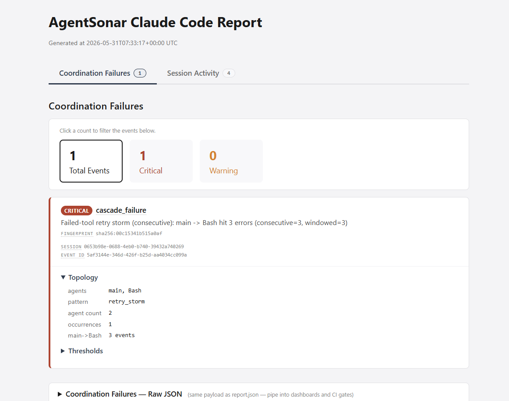
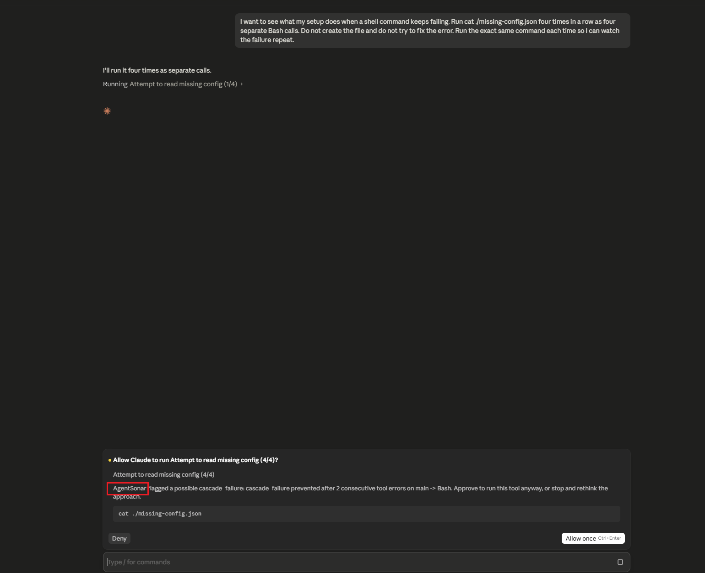
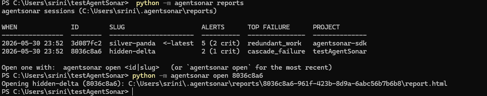

# Claude Code adapter

AgentSonar plugs into Claude Code through its hooks system. It watches the
tool calls and subagent activity in a session as coordination events, in real
time, and writes a session report you can open in a browser. It works the same
way in **both the Claude Code terminal CLI and the Claude Code desktop app** —
both read the same `.claude/settings.json` hooks, so a single setup covers both.

It is **content-blind**: tool inputs, tool outputs, prompts, and file contents
are never read, logged, or persisted. AgentSonar only sees the *shape* of the
activity — which tool ran, when, whether it succeeded, how subagents fanned out.

## Install

The entire setup is **two lines** — install the package, then wire the hooks:

```bash
pip install agentsonar
agentsonar install-claude-hooks
# (or: `python -m agentsonar install-claude-hooks` — works without `agentsonar`
#  on PATH, helpful on Windows or inside an unactivated virtual environment)
```

`install-claude-hooks` writes the right hooks into `.claude/settings.json` for
you in one command. It is **merge-safe**: existing non-AgentSonar hooks and any
other settings are preserved, and re-running it never double-registers.

### Where the hooks go: this project vs every project

By default the installer writes **project-level** hooks to
`./.claude/settings.json` in the current folder, so AgentSonar only watches this
project. Claude Code reads settings from three places, and you can target any of
them:

| Scope | File | Install command |
|---|---|---|
| **This project** (default; commit to share with your team) | `./.claude/settings.json` | `agentsonar install-claude-hooks` |
| **This project, just you** (gitignored, not shared) | `./.claude/settings.local.json` | `agentsonar install-claude-hooks --path .claude/settings.local.json` |
| **Every project** (your whole machine) | `~/.claude/settings.json` | `agentsonar install-claude-hooks --path ~/.claude/settings.json` |

Pick **this project** if you want AgentSonar versioned alongside the repo, or
**every project** if you want it watching all your Claude Code work without
per-repo setup. The same `env` tuning and Prevent knobs (below) apply at whichever
level you choose; if more than one level sets a key, Claude Code's own precedence
wins (project-local over project over user).

Start a fresh Claude Code session after installing so the hooks load, then
[see it in action](#see-it-in-action) to watch a detector fire in about a minute.

## Manual setup

If you'd rather wire it by hand, add this `hooks` block to your
`.claude/settings.json`. This is exactly what `install-claude-hooks` writes —
the minimal set of events AgentSonar needs, nothing more:

```json
{
  "hooks": {
    "PreToolUse": [
      { "matcher": "*", "hooks": [ { "type": "command", "command": "python -m agentsonar claude-code-hook PreToolUse", "timeout": 60 } ] }
    ],
    "PostToolUse": [
      { "matcher": "*", "hooks": [ { "type": "command", "command": "python -m agentsonar claude-code-hook PostToolUse", "timeout": 60 } ] }
    ],
    "PostToolUseFailure": [
      { "matcher": "*", "hooks": [ { "type": "command", "command": "python -m agentsonar claude-code-hook PostToolUseFailure", "timeout": 60 } ] }
    ],
    "Stop": [
      { "hooks": [ { "type": "command", "command": "python -m agentsonar claude-code-hook Stop", "timeout": 60 } ] }
    ],
    "SubagentStop": [
      { "hooks": [ { "type": "command", "command": "python -m agentsonar claude-code-hook SubagentStop", "timeout": 60 } ] }
    ]
  }
}
```

`.claude/settings.json` must be strict JSON — no comments, no trailing commas —
or Claude Code silently ignores it.

Why these five and not more: each one feeds detection, and nothing here is
noise. `PreToolUse` is the one that sees every tool call (and is where Prevent
Mode can block); `PostToolUse` / `PostToolUseFailure` close out each call so a
finished tool isn't mistaken for a hung one and so repeated failures are caught;
`Stop` and `SubagentStop` are low-frequency lifecycle events that regenerate the
report and keep the subagent count honest. AgentSonar deliberately does **not**
subscribe to `UserPromptSubmit`, `Notification`, or the compaction hooks — they
carry no coordination signal and would only add overhead.

`timeout` is in **seconds** (60 here), comfortably above AgentSonar's own
internal lock timeout so a hook is never killed mid-write.

> **Performance note (optional).** On recent Claude Code builds you can add
> `"async": true` to the `PostToolUse` and `PostToolUseFailure` command entries
> so those two run fully in the background, off the tool-call hot path. Leave
> `PreToolUse` synchronous — Prevent Mode blocks a tool call by exiting there,
> which only works on a blocking hook. Older builds simply ignore the flag.

## See it in action

The detectors watch your normal work, but you can make one fire on purpose in a
minute or two, which is the fastest way to see what a real alert looks like. The
example below reproduces the single most common Claude Code complaint: an agent
**stuck retrying a command that keeps failing** (the "infinite retry loop" in
[anthropics/claude-code#19699](https://github.com/anthropics/claude-code/issues/19699)).
AgentSonar calls this `cascade_failure`.

The demo prompt is deliberately wasteful so a detector trips fast. In real use
you don't do anything special, AgentSonar just watches.

### 1. Trigger a detection (no config needed)

In a Claude Code session with the hooks installed, paste:

> I want to see what my setup does when a shell command keeps failing. Run
> `cat ./missing-config.json` four times in a row as four separate Bash calls.
> Do not create the file and do not try to fix the error. Run the exact same
> command each time so I can watch the failure repeat.

Each `cat` exits with an error, so AgentSonar sees the same tool failing again
and again on the same edge: that is a retry storm. It warns at 2 consecutive
errors and escalates to CRITICAL at 3.

As soon as Claude finishes replying, the report is written (you don't have to
wait until the session is over, it refreshes after every reply). Open the most
recent one:

```bash
agentsonar open
```

You'll see a `cascade_failure` card with the failing tool, the consecutive
error count, and the severity:



`agentsonar open` launches the most recent report; `agentsonar reports` lists
every past run so you can reopen an older one. More on both under
[Viewing reports across sessions](#viewing-reports-across-sessions).

### 2. Turn on Prevent Mode and watch it stop

Detection tells you after the fact. Prevent Mode stops the loop *before* the
next failing call. It takes **two** environment variables in your
`.claude/settings.json` `env` block, and the distinction matters:

```json
{
  "env": {
    "AGENTSONAR_PREVENT_CASCADE_FAILURE_MAX_ERRORS": "2"
  },
  "hooks": { "...": "your hooks block from above" }
}
```

- The `AGENTSONAR_PREVENT_<CLASS>_<KNOB>` variable is what **arms** prevention
  for that failure class. Without one of these, nothing is ever blocked.

Relaunch Claude Code so the new `env` block loads (settings env is read at
startup), then run the same prompt. After two failures, when Claude tries the
third, AgentSonar interrupts and asks *you* whether to continue, the default
**ask** surface:



Choose to stop and the retry loop ends right there, instead of burning four (or
forty) calls on a path that was never going to succeed.

This isn't demo-only. The knob lives in your settings, so once it's set,
prevention stays on for **every** session from then on, no per-run setup. A real
retry storm in ordinary work is caught the same way, in the same session it
happens in.

To make it a hard block instead of a prompt (the call is refused outright, no
approve button), add the **decision** variable too:

```json
{
  "env": {
    "AGENTSONAR_PREVENT_CASCADE_FAILURE_MAX_ERRORS": "2",
    "AGENTSONAR_PREVENT_DECISION": "deny"
  }
}
```

`AGENTSONAR_PREVENT_DECISION` only chooses *how* a trip surfaces (`ask` vs
`deny`); on its own it arms nothing. Pair it with at least one
`AGENTSONAR_PREVENT_*` knob (or `AGENTSONAR_PREVENT_ALL=1`).

The same pattern arms any detector, swap in the knob for the one you want:

| To prevent | Set |
|---|---|
| Retry storm (this demo) | `AGENTSONAR_PREVENT_CASCADE_FAILURE_MAX_ERRORS=2` |
| Silent loop | `AGENTSONAR_PREVENT_CYCLE_MAX_ROTATIONS=5` |
| Redundant work | `AGENTSONAR_PREVENT_REDUNDANT_WORK_MAX_REPEATS=3` |
| Subagent fan-out | `AGENTSONAR_PREVENT_SUBAGENT_EXPLOSION_MAX_CONCURRENT=5` |
| Everything at once | `AGENTSONAR_PREVENT_ALL=1` |

Full list under [Prevent Mode](#prevent-mode).

> **Tip:** AgentSonar surfaces each distinct alert once per session, so if you
> want to *see the prompt again* after approving or denying it, start a fresh
> session. (This only affects re-running the demo; a new failure pattern always
> triggers.)

## What gets detected

The full coordination-failure surface applies — AgentSonar watches the shape of
the tool and subagent traffic, not the content:

- **Silent loops** — work bouncing between agents/steps forever with no progress.
- **Repeated calls** — the same agent or tool invoked over and over with the same input.
- **Traffic spikes** — a sudden burst of calls wildly out of pattern.
- **Redundant work** — the same tool called again with identical arguments, returning nothing new.
- **Stuck / hung tool calls** — a tool (including a hung MCP server) that starts and never returns.
- **Subagent explosion** — a runaway fan-out of subagents spawned at once.
- **Failed-tool retry storms** — an agent hammering the same failing tool or endpoint.
- **Context-window cliff** — the session filling the model's context window toward quality degradation and the next autocompact, read from the real token counts in the transcript.

## What it saves you

In a Claude Code session these failures bill you for every wasted tool call and model turn. This is documented, not hypothetical: a stuck agent loop cost **$437** overnight ([Dev Journal, 2026](https://earezki.com/ai-news/2026-04-29-i-let-my-ai-agent-run-overnight-it-cost-437/)); a tool-call loop fired **14,000 identical `list_files` calls** ([LeanOps, 2026](https://leanopstech.com/blog/agentic-ai-cost-runaway-token-budget-2026/)); a four-agent pipeline burned **$47** on one stuck loop.

Two illustrative examples at [Claude Sonnet pricing](https://platform.claude.com/docs/en/about-claude/pricing) ($3 / $15 per million input / output tokens):

- **A subagent review loop, auto-stopped.** A reviewer subagent that never approves, ~$0.08 per rotation. Left running it reaches ~960 rotations by morning (≈ **$77**); Prevent Mode stops it at rotation 15 (≈ **$1.20**). **Saved: ~$76.**
- **Re-reading the same file, caught at read #3.** An agent re-reads a file it already read — 14,000 times in the worst documented case (≈ **$190**). `redundant_work` flags it at the 3rd identical read and, with Prevent on, blocks the 4th (≈ **$0.04**). **Saved: ~$190.**

The figures are illustrative (your tokens-per-call will vary), but the shape holds: a failure that would otherwise run for hours is caught in seconds, at single-digit-call cost. Full assumptions and math: [README → What it saves you](../../README.md#what-it-saves-you).

## Tuning thresholds (env vars)

In Claude Code you don't pass a config dict — you set environment variables in
the same `.claude/settings.json`, under an `"env"` block alongside `"hooks"`.
Every config key has an `AGENTSONAR_<UPPER_SNAKE>` equivalent. You only set the
ones you want to change; everything else uses the defaults (the Claude Code
adapter already raises stall + subagent concurrency for coding work, so most
people set nothing here).

```json
{
  "env": {
    "AGENTSONAR_CYCLE_WARNING_THRESHOLD": "5",
    "AGENTSONAR_CYCLE_CRITICAL_THRESHOLD": "15",
    "AGENTSONAR_REDUNDANT_TOOL_WARNING_THRESHOLD": "3",
    "AGENTSONAR_REDUNDANT_TOOL_CRITICAL_THRESHOLD": "5",
    "AGENTSONAR_SUBAGENT_CONCURRENT_THRESHOLD": "8",
    "AGENTSONAR_SUBAGENT_BURST_THRESHOLD": "10",
    "AGENTSONAR_STUCK_WARNING_TIMEOUT_SECONDS": "120",
    "AGENTSONAR_STUCK_CRITICAL_TIMEOUT_SECONDS": "300",
    "AGENTSONAR_RETRY_STORM_WARNING_THRESHOLD": "2",
    "AGENTSONAR_RETRY_STORM_CRITICAL_THRESHOLD": "3",
    "AGENTSONAR_CONTEXT_CLIFF_WARNING_FRACTION": "0.50",
    "AGENTSONAR_CONTEXT_CLIFF_CRITICAL_FRACTION": "0.75",
    "AGENTSONAR_MODEL_CONTEXT_SIZE_TOKENS": "200000"
  },
  "hooks": {
    "...": "your hooks block from above"
  }
}
```

The values above are the effective Claude Code defaults — this block is shown so
you can see the full surface and edit any line; you don't need to add it to
detect out of the box. Full key-by-key reference (and the equivalent config
dict): [`../configuration.md`](../configuration.md#complete-example-every-knob).

## Prevent Mode

Prevent Mode is opt-in. When a failure crosses the limit you set, AgentSonar can
stop the run *before* the next tool call. On Claude Code it surfaces two ways,
chosen by the `AGENTSONAR_PREVENT_DECISION` environment variable:

- **`ask` (default)** — AgentSonar emits a `permissionDecision: "ask"` response,
  so Claude Code prompts *you* ("AgentSonar flagged a possible … — approve, or
  stop and rethink?"). Non-destructive; you stay in the loop. Surfaced once per
  edge per session so it doesn't nag.
- **`deny`** — AgentSonar hard-blocks the tool call (the hook exits with code 2,
  which Claude Code treats as "block this call") and prints why on stderr.

Arm a class with its env knob, e.g.:

```bash
# block a runaway loop after 3 rotations
export AGENTSONAR_PREVENT_CYCLE_MAX_ROTATIONS=3
# or turn on prevention for every class at once
export AGENTSONAR_PREVENT_ALL=1
# choose the surface (default is ask)
export AGENTSONAR_PREVENT_DECISION=deny
```

Each failure class has its own knob (`AGENTSONAR_PREVENT_<CLASS>_<KEY>`); see
[`../prevent-mode.md`](../prevent-mode.md) and [`../configuration.md`](../configuration.md)
for the full list.

## Privacy / content-blind contract

AgentSonar never reads or stores tool input bodies, tool output bodies, prompts,
or file contents — only identifiers and counts (tool name, timestamps,
success/error, subagent type). For regulated environments, set
`AGENTSONAR_REGULATED=1` and file paths are stored as SHA-256 hashes instead of
cleartext.

## Viewing reports across sessions

The easiest way to find and open a report is the built-in CLI.
`agentsonar reports` lists every session, newest first, and `agentsonar open`
opens one in your browser:

```bash
agentsonar reports        # list every session
agentsonar open           # open the most recent
agentsonar open <slug>    # open a specific one, e.g. agentsonar open hidden-delta
```



Each session gets a short, memorable slug (like `hidden-delta`) derived from its
id, so you can tell runs apart at a glance and reopen one without copying a UUID.
`agentsonar open` also accepts a full session id or an unambiguous id prefix.

> These two commands are specific to the Claude Code adapter, which centralizes
> reports under `~/.agentsonar/`. The LangGraph, CrewAI, and custom-Python
> adapters write to a local `./agentsonar_logs/run-<slug>/` folder next to your
> script instead, so you open those reports directly.

## Where the report goes

Everything is written under `~/.agentsonar/` in your home directory, keyed by the
Claude Code **session id**:

```
~/.agentsonar/
├── reports/
│   ├── latest                  # one-line file: the most recent session id
│   └── <session-id>/
│       ├── report.html         # open this in a browser
│       ├── report.json         # same data, for dashboards / CI
│       └── alerts.log          # plain-text alert stream
└── sessions/
    └── <session-id>/
        └── timeline.jsonl      # append-only record of every event
```

The report is regenerated every time Claude finishes replying (the `Stop` hook
fires at the end of each turn), accumulating the whole session into the same
file. So a long-running session (Claude Code sessions can run for days) always
has one up-to-date `report.html`, current as of Claude's last reply, rather than
a separate report per turn.

### Opening a report by hand

If you'd rather not use the CLI, the `reports/latest` pointer holds the id of the
most recent session, and every report directory is named by its session id:

```bash
# macOS / Linux: open the latest
open ~/.agentsonar/reports/$(cat ~/.agentsonar/reports/latest)/report.html
# or a specific session
open ~/.agentsonar/reports/<session-id>/report.html
```

```powershell
# Windows (PowerShell): open the latest
$id = Get-Content $HOME\.agentsonar\reports\latest
Invoke-Item $HOME\.agentsonar\reports\$id\report.html
```

The session id is Claude Code's own id for the conversation. It's shown at the
top of `report.html` and in the `session_id` field of every `report.json` and
`timeline.jsonl` record, so a report you've opened always tells you which session
it belongs to.

## See also

- [Concepts](../concepts.md): what counts as a coordination failure.
- [Prevent Mode](../prevent-mode.md): the full auto-stop / ask walkthrough.
- [Configuration](../configuration.md): every config knob and environment variable.
- [FAQ](../faq.md)
